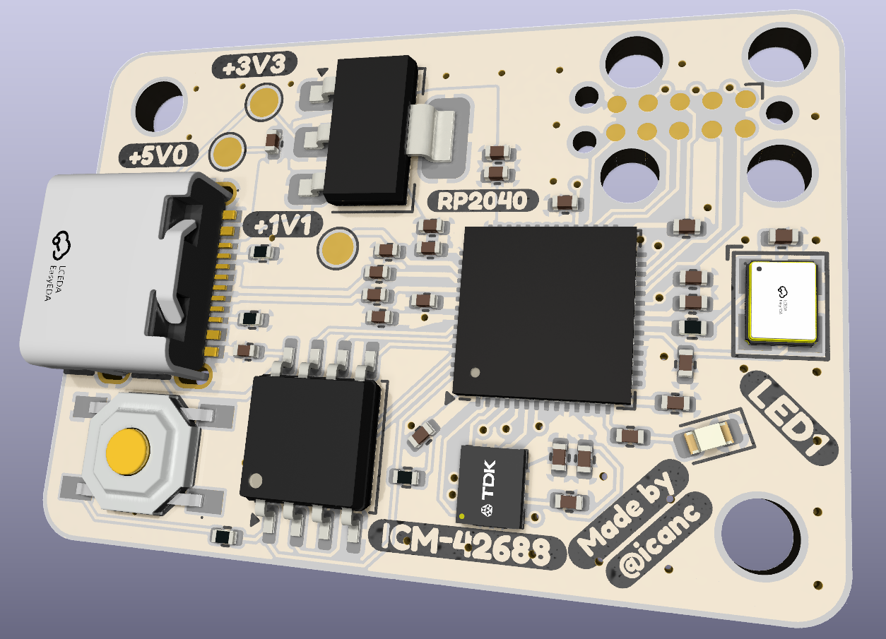
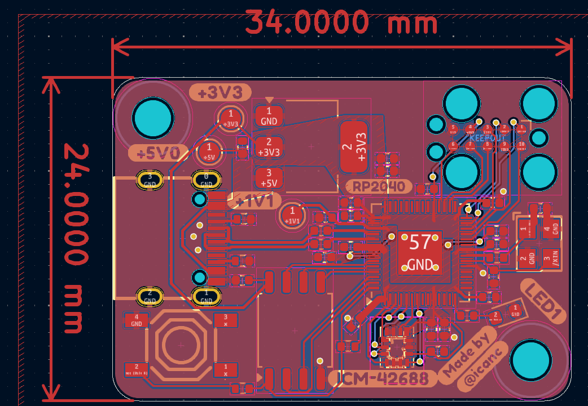

# Reality From Scratch Motherboard

### RP2040+ICM42688 board made by Vincent Xie (@icanc)

> [!CAUTION]
> This board has not been tested to function properly

Features:
- ICM-42688 over SPI
- TC2050 connector for debugging and GPIO testing
- LEDs for status
